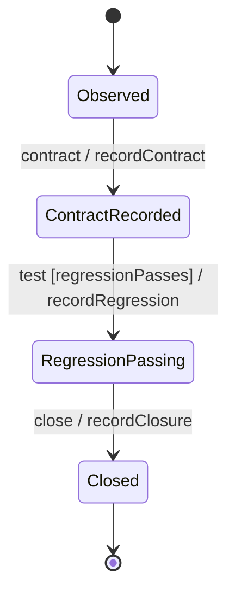

# Dogfood failure promotion

Failures found while using the latest workflow become explicit contracts and regression tests before they are considered closed.

```mermaid
stateDiagram-v2
  %% @name DogfoodFailurePromotion
  [*] --> Observed
  Observed --> ContractRecorded : contract / recordContract
  ContractRecorded --> RegressionPassing : test [regressionPasses] / recordRegression
  RegressionPassing --> Closed : close / recordClosure
  Closed --> [*]

  %% @test Observed --contract--> ContractRecorded
  %% @test ContractRecorded --test--> RegressionPassing
  %% @test RegressionPassing --close--> Closed
  %% @test Observed --close--> !invalid
```
