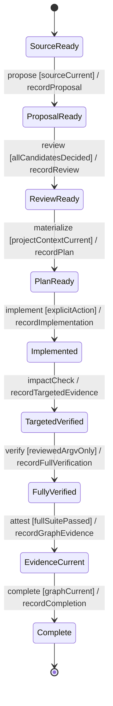

# Reviewed workflow lifecycle

This contract makes the terminal boundary explicit: targeted impact checks can guide work, but only the reviewed full suite and fresh graph evidence can complete a lifecycle.

